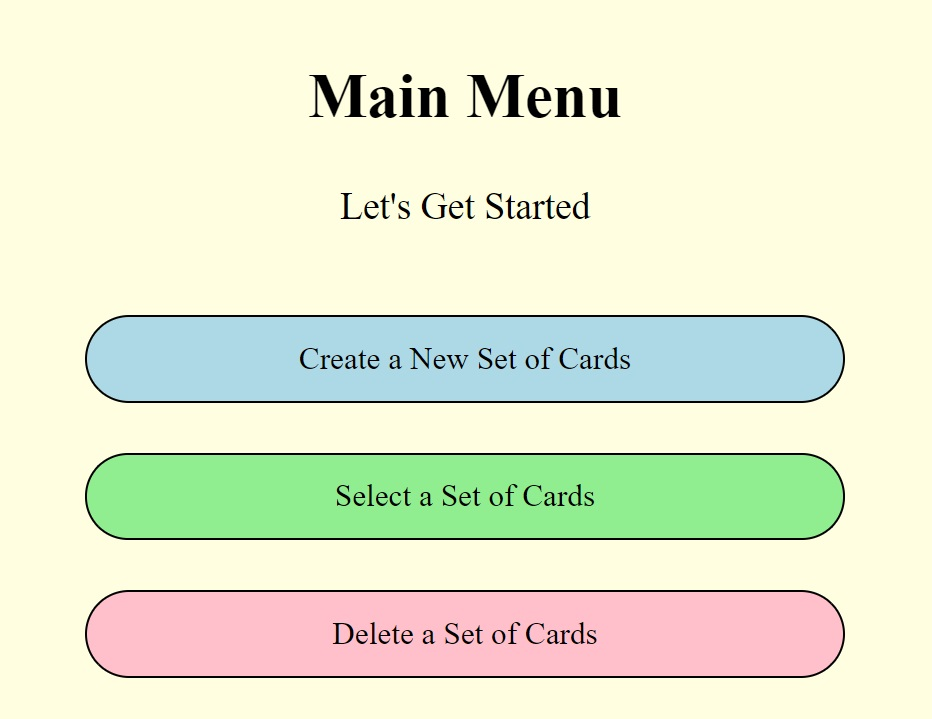
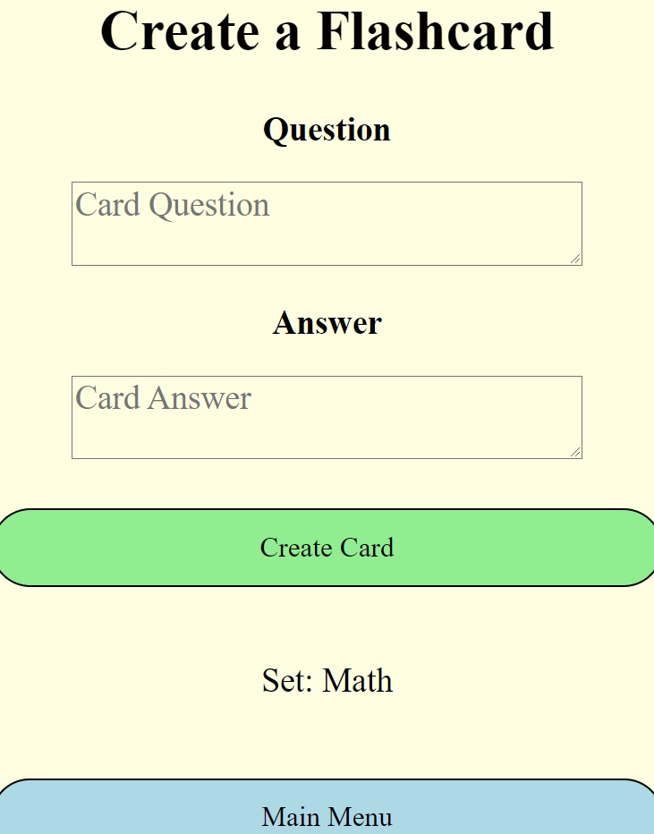
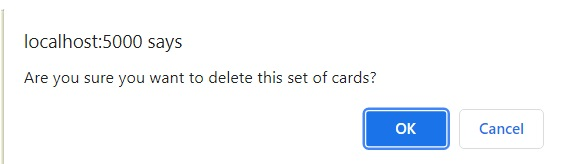

# Flash-Cards

## A small app to create flash cards and practice with!

 

# Table of Contents

* <a href='#Introduction'>Introduction</a>
* <a href='#Skills'>Skills</a>
* <a href='#Setup'>Setup</a>
* <a href='#Tutorial'>Tutorial</a>
* <a href='#Contact'>Contact</a>

 

# Introduction

I was inspired to make this app because I am in college and flash cards are a useful tool. This application allows one to create sets of flash cards, populate those sets of cards, practice with them, delete cards, and delete sets of cards.

 

# Skills

I used several of my skill-sets in this project including:
* Python
* Flask
* Jinja 2
* Javascript
* SQL
* HTML
* CSS
* UX/UI Design

 

# Setup

To use this app make sure to have <a href="https://www.python.org/downloads/">Python</a> Installed on your computer. Once you have done this go to the command prompt and navigate to where these files have been downloaded. Next make sure to install the python package `virtualenv`. Then create your own personal virtual environment and activate it. You can do this by typeing the following commands.  

Navigate to where these files have been downloaded 
`cd your_file_path_here` 

Install virtualenv  
`pip install virtualenv`  

Create your own virtual environment  
`venv env`  
Activate your virtual environment (Windows Terminal)  
`source env/scripts/activate.bat`  
Activate your virtual environment (Windows using GitBash)  
`source env/scripts/activate`  
Activate your virtual environment (Apple & Linux Terminals)  
`source env/bin/activate`  

Afterwards install the necessary packages for this application. These are just `flask` and `sqlite3`.  
`pip install -r requirements.txt` or `pip install flask, sqlite3`  

After this install the required packages for this application (these are just `flask` and `sqlite3`).  
`pip install -r requirements.txt`  

Now all you have to do is type this command in the terminal to run the app and it will run a virtual server on your local machine. Most likely local host 5000. Simply run the `app.py` file.  
`python app.py`  

The following should pop up in the terminal. (The address may be different on your machine.) 
`Running on http://127.0.0.1:5000/ (Press CTRL+C to quit)`  
Lastly go to Google Chrome or whatever browser you use and pass in the link given to you in the terminal. Viola! The app is running!  

  

  

# Tutorial

To use the app first click on the button that says "Create a New Set of Cards". Here you can name a set of flash cards. After creating a set you will automatically be prompted to fill out your first card. Simply type in the question and the answer you wish to have on your card.

 

 

Now you are enabled to practice! After creating a card you will automatically be brought to the practicing page. The question will be presented and you can type your best answer in the text field. Afterward hit "Confirm Answer" and the text field will become normal text and the true answer will be revealed! From here you can go to the next card in the set, create more cards, delete the current card, or go back to the main menu. When practicing cards will be shuffled every time a new card is pulled. Lastly, in the main menu you have the options to choose a set to practice or choose a set to delete. In both cases a list of existing card sets will be displayed. The former option sends you to practice and the latter deletes the set. A warning prompt is issued before anything is deleted ensuring you are not deleting anything accidentally. 

 

 

# Contact

My name is George Bennett. I completed a datascience bootcamp with <a href='https://flatironschool.com/'>Flat Iron School</a> and am currently in college pursuing a bachelor's in computer science. My goal is to one day be a professional software engineer or datascientist. 

 

<a href='https://github.com/GeorgeWilliamBennett/'>GitHub</a>

<a href='https://www.linkedin.com/feed/'>LinkedIn</a>
